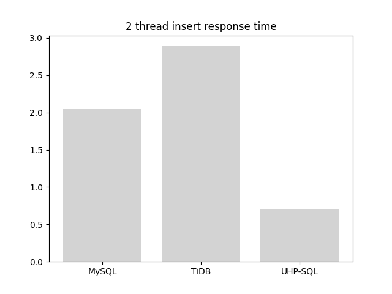

# UHP-SQL
UHP-SQL 是一个基于 [英特尔® 傲腾™ 持久内存 ](https://www.intel.cn/content/www/cn/zh/architecture-and-technology/optane-dc-persistent-memory.html) 设计的新型分布式关系型数据库系统。

### 架构


### 特性

#### 超高性能
持久化内存在性能上有天然的优势，使用 UHP-SQL 可以加速你的应用。在保证数据持久化的同时，获得超高性能的在线读写，以及查询分析能力。

#### 可扩展
UHP-SQL 使用 eraft 协议实现了数据库横向扩展的能力，并基于云原生平台开发实现，可以实现一键启动云上持久化内存数据库实例，5分钟启动，并提供了 Web 控制端，快速上手使用。

#### 支持 SQL
UHP-SQL 兼容 MySQL 协议标准，你可以轻松的使用 mysql 客户端连接上 UHP-SQL 实例，可以低成本将应用从老的 MySQL 迁移过来。

### 快速上手

目前 UHP-SQL 发布了 Demo v0.1 版本，可以在装有 docker 环境的机器上运行。

#### 1.生成镜像

```
git clone https://github.com/eraft-io/UHP-SQL.git; cd UHP-SQL
make image
```

#### 2.运行 UHP-SQL 实例
```
make build-dev
make run
```

#### 3.本地连接
注意：mysql 版本 <= 5.1.70

```
mysql --host 127.0.0.1 --port 12306 -u root
```

#### 4.SQL测试

1) 建表

```
CREATE TABLE classtab 
( 
    Name VARCHAR(100), 
    Class VARCHAR(100), 
    Score INT, 
    PRIMARY KEY(Name)
);
```

```
mysql> CREATE TABLE classtab
    -> (
    -> Name VARCHAR(100),
    -> Class VARCHAR(100),
    -> Score INT,
    -> PRIMARY KEY(Name)
    -> );
Query OK, 1 row affected (0.06 sec)
```

2) 插入数据

```

INSERT INTO classtab 
(
Name, 
Class
) 
VALUES 
('Tom', 
'B');

INSERT INTO classtab 
(
Name, 
Class,
Score
) 
VALUES 
('Tom2', 
'B', 
'93');

INSERT INTO classtab 
(
Name, 
Class,
Score
) 
VALUES 
('Tom22', 
'B', 
'93');

INSERT INTO classtab 
(
Name, 
Class,
Score
) 
VALUES 
('Tom6', 
'B', 
'90');
```


```
...
mysql> INSERT INTO classtab
    -> (
    -> Name,
    -> Class,
    -> Score
    -> )
    -> VALUES
    -> ('Tom6',
    -> 'B',
    -> '90');
Query OK, 1 row affected (0.01 sec)
```

3) 查询数据

```
SELECT * from classtab;
```


```
+-------+-------+-------+
| Name  | Class | Score |
+-------+-------+-------+
| Tom   | B     |       |
| Tom2  | B     | 93    |
| Tom22 | B     | 93    |
| Tom6  | B     | 90    |
+-------+-------+-------+
4 rows in set (0.00 sec)

```

4) 更新数据

```
UPDATE classtab  SET Score='78' WHERE Name='Tom2';
```


```
mysql> UPDATE classtab  SET Score='78' WHERE Name='Tom2';
Query OK, 1 row affected, 1 warning (0.00 sec)

mysql> SELECT * from classtab;
+-------+-------+-------+
| Name  | Class | Score |
+-------+-------+-------+
| Tom   | B     |       |
| Tom2  | B     | 78    |
| Tom22 | B     | 93    |
| Tom6  | B     | 90    |
+-------+-------+-------+
4 rows in set (0.00 sec)

```

5) LIKE 查询

```
SELECT * from classtab WHERE Name LIKE 'Tom2%' limit 10;
```

```
mysql> SELECT * from classtab WHERE Name LIKE 'Tom2%' limit 10;
+-------+-------+-------+
| Name  | Class | Score |
+-------+-------+-------+
| Tom2  | B     | 78    |
| Tom22 | B     | 93    |
+-------+-------+-------+
2 rows in set (0.00 sec)
```

6) 范围查询大于

```
SELECT * from classtab WHERE Name > 'Tom2' limit 10;
```

```
mysql> SELECT * from classtab WHERE Name > 'Tom2' limit 10;
+-------+-------+-------+
| Name  | Class | Score |
+-------+-------+-------+
| Tom22 | B     | 93    |
| Tom6  | B     | 90    |
+-------+-------+-------+
2 rows in set (0.03 sec)
```

7)  = 查询


```
SELECT * from classtab WHERE Name = 'Tom22';
```

```
mysql> SELECT * from classtab WHERE Name = 'Tom22';
+-------+-------+-------+
| Name  | Class | Score |
+-------+-------+-------+
| Tom22 | B     | 93    |
+-------+-------+-------+
1 row in set (0.00 sec)
```

8) 删除数据

```
DELETE FROM classtab WHERE Name='Tom';
```

```
mysql> DELETE FROM classtab WHERE Name='Tom';
Query OK, 1 row affected, 1 warning (0.04 sec)

mysql> SELECT * from classtab WHERE Name = 'Tom';
Empty set (0.01 sec)
```

### 性能测试

v0.1 实现有点粗糙、但是由于持久内存的优势，插入性能还是优于单机版的 MySQL，以及单机集群版本的 TiDB

- 2个线程插入 TPS


- 2个线程插入响应耗时


